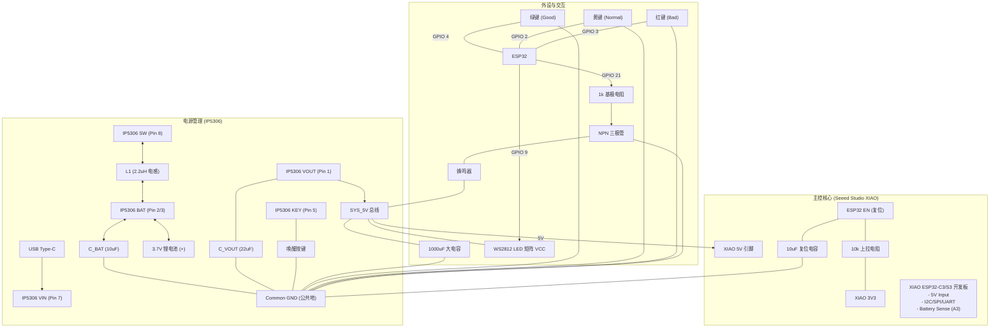

# Pixel Caddy 硬件原理图方案

本项目基于 **ESP32-S3** 主控芯片与 **IP5306** 电源管理芯片，构建一个集充电、升压供电与逻辑控制于一体的便携式设备。

## 1. 系统框图 (Block Diagram)

## 2. 核心模块电路详解

### 2.1 电源管理 (IP5306)
IP5306 是一款集成升压转换器、锂电池充电管理、电池电量指示的多功能电源管理 SoC。

*   **输入 (Charging)**: USB Type-C 供电，连接 VIN (Pin 7)。
*   **输出 (Discharge)**: VOUT (Pin 1) 直接输出 5V 到 SYS_5V 总线。
*   **关键外围元件**:
    *   **电感 (L1)**: 推荐 **2.2uH** (饱和电流 > 2A)，连接在 SW (Pin 8) 和 BAT 回路中。
    *   **电容**: BAT 端需 10uF 陶瓷电容，VOUT 端需 22uF 陶瓷电容滤波。
    *   **按键 (Key)**: 连接 Pin 5 (KEY)，短按可唤醒输出/查看电量，长按可关闭输出。

**连接网络:**
*   `IP5306_VIN` <-> `USB_VBUS`
*   `IP5306_BAT` <-> `Li-Po Battery (+)`
*   `IP5306_VOUT` <-> `SYS_5V`

**电池保护机制 (Built-in Protection):**
IP5306 内部集成了完善的锂电池保护功能，**无需**额外加保护板 (Protection Board)：
*   **过充保护 (Overcharge)**: 4.20V / 4.35V / 4.40V 满电自动停充。
*   **过放保护 (Over-discharge)**: 电池电压低于 3.0V 报警 (灯闪烁)，低于 2.4V 自动锁死关机，保护电池不损坏。
*   **过流/短路保护 (Over-current)**: 输出端电流过大或短路时自动关闭输出。
*   **温度保护 (Thermal)**: 芯片温度过高时自动降流或关机。

### 2.2 主控 (Seeed Studio XIAO)
*   **供电**: `SYS_5V` 直接接入 XIAO 开发板的 **5V** 输入引脚。XIAO 内部自带稳压电路提供 3.3V。
*   **复位**: EN 引脚接 10uF 电容至地，10k 电阻上拉至 3.3V (RC复位电路)。注意：XIAO 开发板通常已集成复位电路，如使用单独模组设计则需保留。

### 2.3 外设引脚映射 (Pinout)

| 功能模块 | 组件名称 | XIAO 引脚 | ESP32-C3 GPIO | ESP32-S3 GPIO | 备注 |
| :--- | :--- | :--- | :--- | :--- | :--- |
| **显示** | WS2812 Matrix | **D9** | GPIO 9 | **GPIO 8** | DI (Data In), 需接 5V 供电 |
| **输入** | 绿键 (Good) | **D1** | GPIO 3 | **GPIO 2** | 另一端接地 (内部上拉) |
| **输入** | 黄键 (Normal) | **D3** | GPIO 5 | **GPIO 4** | 另一端接地 (内部上拉) |
| **输入** | 红键 (Bad) | **D2** | GPIO 4 | **GPIO 3** | 另一端接地 (内部上拉) |
| **反馈** | 无源蜂鸣器 | **D0** | GPIO 2 | **GPIO 1** | PWM 音频输出 |
| **ADC** | 电池电压 | **D4** | GPIO 4 | **GPIO 5** | 需分压电路 |

## 3. 详细连接表 (Netlist Style)

### A. IP5306 (SOP8 封装)
1.  **VOUT**: -> `SYS_5V`
2.  **BAT**: -> 锂电池正极 (+), 同时接 10uF 电容接地
3.  **BAT**: -> 同 Pin 2
4.  **LED2**: (可选) 电量指示灯
5.  **KEY**: -> 轻触开关 -> 地 (用于激活电源)
6.  **LED1**: (可选) 电量指示灯
7.  **VIN**: -> USB Type-C VBUS
8.  **SW**: -> 2.2uH 电感 -> `IP5306_BAT`

### B. XIAO 开发板 (ESP32-S3)
*   **5V / VIN**: <- `SYS_5V` (来自 IP5306)
*   **GND**: -> 公共地 (Common GND)
*   **D9 (GPIO 8)**: -> WS2812 `DIN`
*   **D1 (GPIO 2)**: -> 绿色按键 (Good) -> GND
*   **D3 (GPIO 4)**: -> 黄色按键 (Normal) -> GND
*   **D2 (GPIO 3)**: -> 红色按键 (Bad) -> GND
*   **D0 (GPIO 1)**: -> 蜂鸣器 PWM 输出

### C. WS2812 LED 矩阵 (16x16)
*   **VCC**: <- `SYS_5V` (注意：全亮时电流较大，确保 IP5306 能够提供足够电流，推荐最大亮度限制在 20-30%)
*   **GND**: -> Common GND
*   **DIN**: <- ESP32 GPIO 9

### D. 电池电压采集 (Battery Monitor)
*   **电路架构**: 电阻分压 (Voltage Divider) + 滤波电容
*   **R1 (上拉)**: 100kΩ (连接电池正极 BAT+)
*   **R2 (下拉)**: 100kΩ (连接地 GND)
*   **C1 (滤波)**: 100nF (连接 ADC 引脚到 GND)
*   **ADC 引脚**: 连接 R1 与 R2 的中间点 -> **XIAO D3 (A3)**
*   **计算公式**: $V_{in} = V_{adc} \times 2$ (采用 1:1 分压)

## 4. 组装提示
1.  **电源激活**: IP5306 在第一次连接电池后可能没有输出，需要给 VIN 充一下电或者按一下 KEY 键来激活。
2.  **布线**: IP5306 获取 5V 输出的电流能力较强 (2A+)，但 WS2812 矩阵全亮瞬间电流可能很大，请务必使用 **粗导线** 连接电源路径，并在矩阵电源端增加 1000uF 电解电容稳压。
3.  **散热**: IP5306 充电和放电时会有发热，PCB 设计时请保留散热焊盘。

## 5. PCB 布局讲究 (Layout Guidelines)

针对 IP5306 及电感 (Inductor) 的布局，请务必遵循以下原则以保证供电稳定和减少干扰：

1.  **靠近摆放 (Proximity)**: 
    *   电感 **L1** 必须尽可能靠近 IP5306 的 **SW (Pin 8)** 引脚。
    *   减小 SW -> L1 -> BAT/VOUT 这一高频开关回路的面积。
2.  **线宽要求 (Trace Width)**:
    *   SW 引脚到电感的走线、电感输出的走线承载大电流，必须**加粗** (建议 > 20mil 或铺铜)。
    *   避免直角走线，使用 45 度角或圆弧。
3.  **避开敏感区 (Keep Out)**:
    *   **切勿**在电感正下方走信号线 (特别是数据线、I2C、ADC 等敏感信号)。电感的磁场变化会干扰下方走线。
    *   电感下方最好**挖空所有层**的铜 (No Copper)，防止产生涡流损耗 (Eddy Currents) 和干扰。如果无法挖空，至少要是完整的地平面，绝不能是分割的地块。
4.  **散热 (Thermal)**:
    *   IP5306 底部通常有散热焊盘 (EPAD)，必须可靠接地并打过孔散热。
